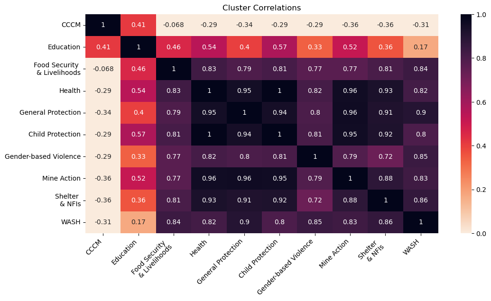

# Ukraine Conflict Humanitarian Needs Overview Analysis
* This project was completed in June 2024, using Python NLP and Data Analysis to understand how the conflict in Ukraine had affected Humanitarian Needs in the area. The following Python libraries were used for this project:
1. Natural Language Toolkit
2. pandas
3. NumPy
4. seaborn
5. matplotlib

## Humanitarian Needs Visualization

**Cluster Heatmap Analysis**: 

**People in Need by Cluster**: 

**Affected Populations**: 

**Cluster Funding Needs**: 

## Ukraine Twitter Sentiment Analysis

**Language Count Analysis**: We can see that the most common language spoken is English followed by Portuguese, Italian, and Middle Egyptian. English is the most common language on Twitter and it follows that users talking about the Ukraine Conflict would be communicating their thoughts in English. It is important to note that some language codes might be incorrectly classified and some user's might change their language on the application.

**Positive Word Analysis**: 

**Negative Word Analysis**: 

**Sentiment Timeline Analysis**:  

## Civilian Casualty Visualization

**Civilian Casualty Analysis**: 

**Oblast Region Events & Fatalities**: 

