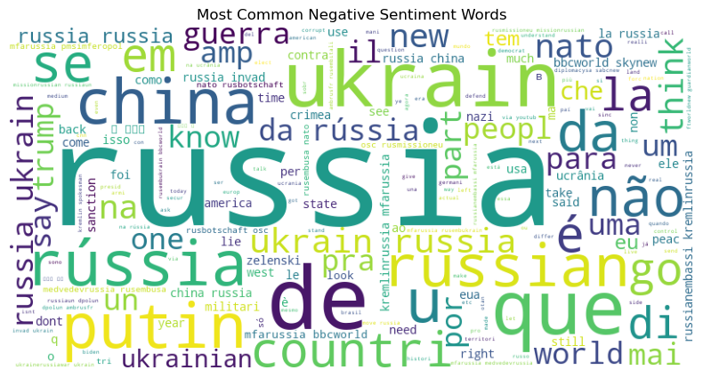

# Ukraine Conflict Humanitarian Needs Overview Analysis

## Humanitarian Needs Visualization

**Cluster Heatmap Analysis**: We can see that the most common language spoken is English followed by Portuguese, Italian, and Middle Egyptian. English is the most common language on Twitter and it follows that users talking about the Ukraine Conflict would be communicating their thoughts in English. It is important to note that some language codes might be incorrectly classified and some user's might change their language on the application.

**People in Need by Cluster**: We can see that the most common language spoken is English followed by Portuguese, Italian, and Middle Egyptian. English is the most common language on Twitter and it follows that users talking about the Ukraine Conflict would be communicating their thoughts in English. It is important to note that some language codes might be incorrectly classified and some user's might change their language on the application.

**Affected Populations**: We can see that the most common language spoken is English followed by Portuguese, Italian, and Middle Egyptian. English is the most common language on Twitter and it follows that users talking about the Ukraine Conflict would be communicating their thoughts in English. It is important to note that some language codes might be incorrectly classified and some user's might change their language on the application.

**Cluster Funding Needs**: We can see that the most common language spoken is English followed by Portuguese, Italian, and Middle Egyptian. English is the most common language on Twitter and it follows that users talking about the Ukraine Conflict would be communicating their thoughts in English. It is important to note that some language codes might be incorrectly classified and some user's might change their language on the application.

## Ukraine Twitter Sentiment Analysis

**Language Count Analysis**: We can see that the most common language spoken is English followed by Portuguese, Italian, and Middle Egyptian. English is the most common language on Twitter and it follows that users talking about the Ukraine Conflict would be communicating their thoughts in English. It is important to note that some language codes might be incorrectly classified and some user's might change their language on the application.

**Positive Word Analysis**: We can see that the most common language spoken is English followed by Portuguese, Italian, and Middle Egyptian. English is the most common language on Twitter and it follows that users talking about the Ukraine Conflict would be communicating their thoughts in English. It is important to note that some language codes might be incorrectly classified and some user's might change their language on the application.

**Negative Word Analysis**: We can see that the most common language spoken is English followed by Portuguese, Italian, and Middle Egyptian. English is the most common language on Twitter and it follows that users talking about the Ukraine Conflict would be communicating their thoughts in English. It is important to note that some language codes might be incorrectly classified and some user's might change their language on the application.

**Sentiment Timeline Analysis**: We can see that the most common language spoken is English followed by Portuguese, Italian, and Middle Egyptian. English is the most common language on Twitter and it follows that users talking about the Ukraine Conflict would be communicating their thoughts in English. It is important to note that some language codes might be incorrectly classified and some user's might change their language on the application.
||

## Civilian Casualty Visualization

**Civilian Casualty Analysis**: We can see that the most common language spoken is English followed by Portuguese, Italian, and Middle Egyptian. English is the most common language on Twitter and it follows that users talking about the Ukraine Conflict would be communicating their thoughts in English. It is important to note that some language codes might be incorrectly classified and some user's might change their language on the application.

**Oblast Region Events & Fatalities**: We can see that the most common language spoken is English followed by Portuguese, Italian, and Middle Egyptian. English is the most common language on Twitter and it follows that users talking about the Ukraine Conflict would be communicating their thoughts in English. It is important to note that some language codes might be incorrectly classified and some user's might change their language on the application.

